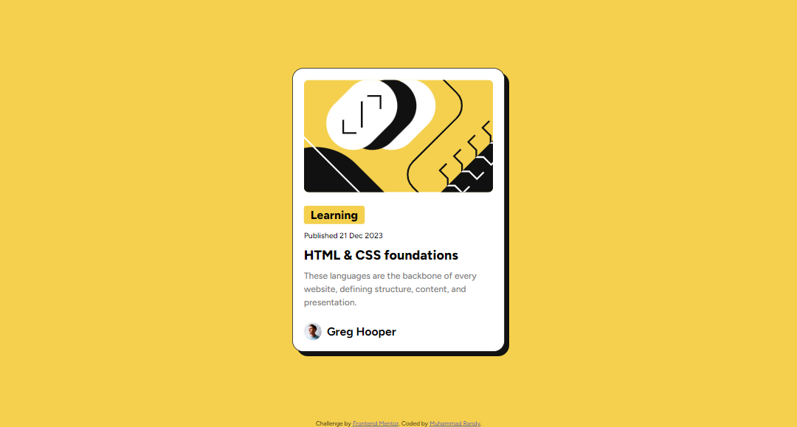
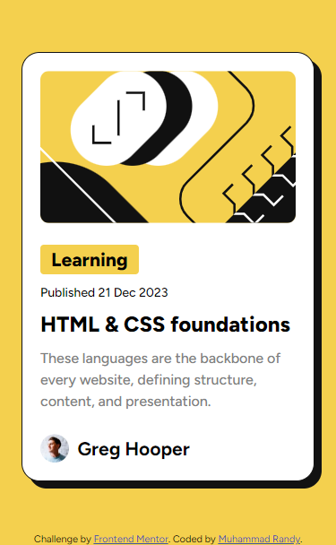
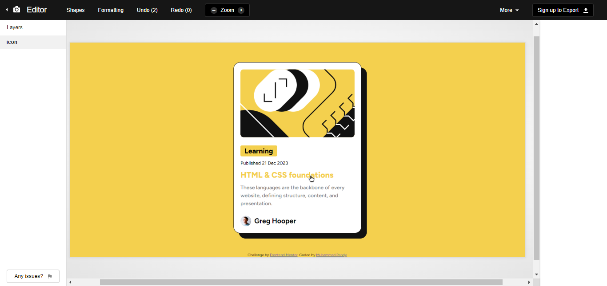

# Frontend Mentor - Blog preview card solution

This is a solution to the [Blog preview card challenge on Frontend Mentor](https://www.frontendmentor.io/challenges/blog-preview-card-ckPaj01IcS). Frontend Mentor challenges help you improve your coding skills by building realistic projects.

## Table of contents

- [Overview](#overview)
  - [The challenge](#the-challenge)
  - [Screenshot](#screenshot)
  - [Links](#links)
- [My process](#my-process)
  - [Built with](#built-with)
  - [What I learned](#what-i-learned)
  - [Useful resources](#useful-resources)
- [Author](#author)

## Overview

### The challenge

Users should be able to:

- See hover and focus states for all interactive elements on the page

### Screenshot

#### Dekstop Preview



#### Mobile Preview



#### Hover Preview



### Links

- Solution URL: [Github](https://your-solution-url.com)
- Live Site URL: [Github Pages](https://your-live-site-url.com)

## My process

### Built with

- Semantic HTML5 markup
- CSS custom properties
- Flexbox
- Responsive

### What I learned

The idea is I want to center the blog card but also want to make the attribution footer placed at bottom. So I try to using flexbox and centering it while justify align the footer, but it didn't work at all. When I search about it, turn out that justify self attribute not working on flex, so they recommended me using margin auto instead. This what my css looks like:

```css
body {
  display: flex;
  flex-direction: column;
  justify-content: center;
  align-items: center;
  min-height: 100dvh;
}

/* blog card */
article {
  margin-top: auto;
}

.attribution {
  margin-top: auto;
}
```

I also learn how to animate change when hovering and translate element. I am using transition to define the change while hovering element. Transition have four value in it, The first value on is what change do you want to transition, the second is the duration, the third is timing function, and the last one is delay. You can just put the first two value in it. In my case, I put three value. While translate allows me to change the position of element. You can put 3 value on translate, the first one is x-axis, the second one is y-axis, and the last one is z-axis. positif value move x-axis to right, y-axis to bottom, and z-axis to blur or up. You can put just one value if you want. This what my css looks like:

```css
/* blog card */
article {
  box-shadow: 8px 8px 0 0 var(--black);
}

article:hover {
  translate: -10px -10px;
  box-shadow: 16px 16px 0 0 var(--black);
  transition: all 0.2s ease-in-out;
}

/* blog title */
.content h2:hover {
  color: var(--yellow);
  transition: color 0.1s ease-in-out;
}
```

### Useful resources

- [W3School](https://www.w3schools.com/) - This helped me for almost anything, just like the documentation of HTML, CSS, and javascript.
- [Stack Overflow](https://stackoverflow.com/) - This is an amazing forum where you can ask or find someone with similiar problem you have that already solved.

## Author

- Website - [Muhammad Randy](https://mrandy-portfolio.web.app/)
- Frontend Mentor - [@MuhRandy](https://www.frontendmentor.io/profile/MuhRandy)
- Twitter - [@RandyThz](https://twitter.com/RandyThz)
